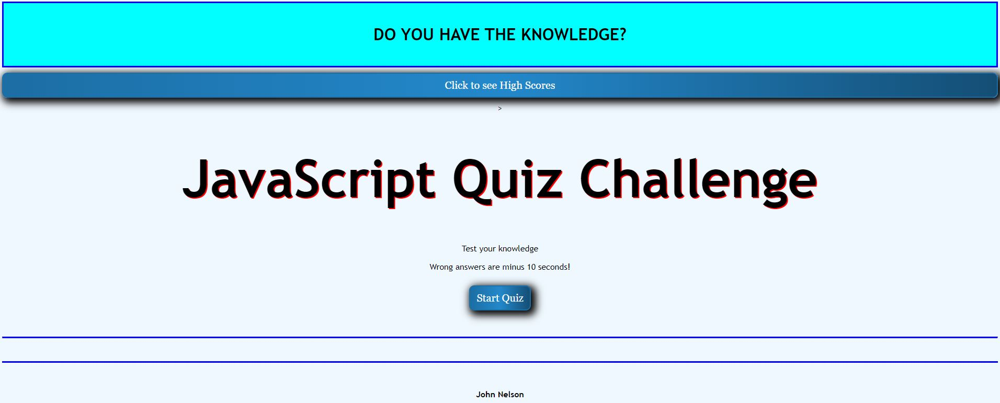

# Module4Challenge - Web APIs Challenge

## Description

Bootcamp: Module 4 Challenge  
Web APIs Challenge - timed quiz
Codebase correction that follows accessibility standards so that the site is optimized for search engines

## Table of Contents (Optional)

N/A

## Installation

Github pages hosting: https://fjnelson.github.io/Module4Challenge/

## Usage

## Credits

Credits for contributions: https://github.com/mmeii/code-quiz
Mmeii on December 4th, 2020

## License

Please refer to the LICENSE in the repo.